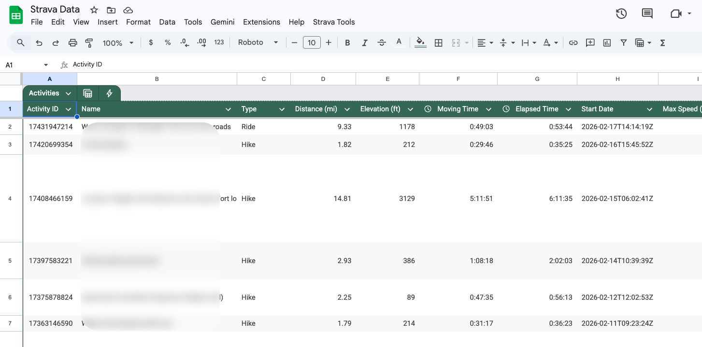

# Strava-to-Sheets Sync

A powerful Google Apps Script designed to synchronize detailed Strava activity data directly into a Google Spreadsheet.

## Key Features

- **Detailed Activity Sync**: Fetches rich data beyond the basic summary, including calories, gear (bikes/shoes), achievement counts, and descriptions.
- **Parallel Processing**: Uses `UrlFetchApp.fetchAll` for high-performance data retrieval, significantly reducing execution time.
- **Robust Token Management**: 
  - Implements OAuth2 with **Token Rotation**. 
  - Automatically handles refresh token updates to keep the connection valid indefinitely.
- **Fast Synchronization**:
  - **Multi-Page Skipping**: Intelligently skips through existing activities on Strava to find new data faster.
  - **Batch Processing**: Handles up to 100 activities per request.
- **Dynamic Column Mapping**: 
  - Automatically detects sheet headers.
  - Correctly maps data to existing columns even if they are moved or renamed (e.g., handles custom "URL ID" or "Strava Link" columns).
- **Embedded Media**: Includes links to activity photos directly in the sheet.
- **Strava Deep Links**: Generates direct links to Strava activities for every record.

## Technical Improvements (Version 2.0)

- **Optimized Paging**: Advanced skipping logic to bypass up to 800 duplicate activities in a single execution.
- **Resilient Authentication**: Refresh tokens are now persisted in `ScriptProperties` to support Strava's security model.
- **Header Flexibility**: Use of name-based column mapping instead of fixed indices for improved sheet compatibility.

## Setup & Configuration

1. **Credentials**: Set your `STRAVA_CLIENT_ID`, `STRAVA_CLIENT_SECRET`, and initial `STRAVA_REFRESH_TOKEN` in `Config.gs`.
2. **First Run**: 
   - Use `testSync` to verify the connection.
   - Use `backfillStravaLinks` to populate links for legacy data (~400 records).
3. **Automation**: The script uses a time-based trigger (`runBatchSync`) to keep your data up to date automatically.

## Files

- `Auth.gs`: OAuth2 and token rotation logic.
- `StravaAPI.gs`: API interaction layer.
- `Main.gs`: Core sync logic, dynamic mapping, and UI tools.
- `Config.gs`: User settings and parameters.
